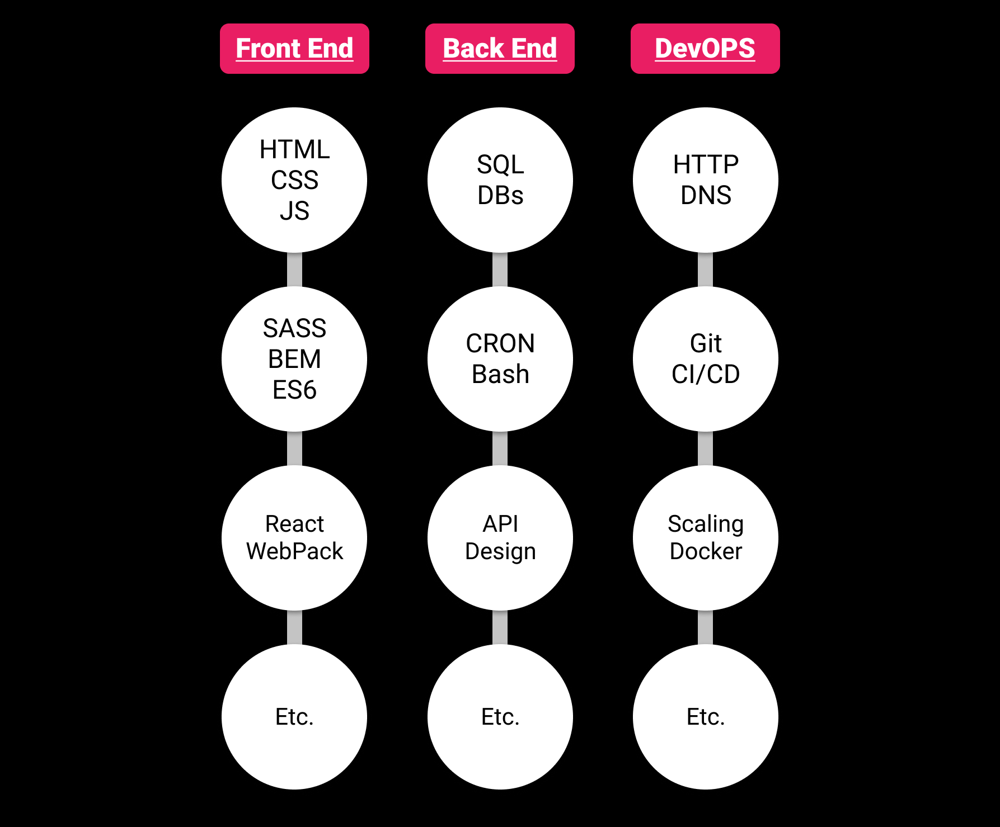

---
date: 2021-04-10T17:07:45.666Z
title: "Be A T H I C C Developer" 
subtitle: "Why 'Wide or Deep' when you can 'Wide AND Deep'?"
featuredImage: "./featuredImage.png"
ogImage: "./ogImage.png"
tags: ['Newsletter', 'Career', 'Automation']
published: true
unlisted: false
--- 

# Don't be a T-Shaped Developer
# Be a T&nbsp;H&nbsp;I&nbsp;C&nbsp;C Developer Instead!

## What's A T-Shaped Developer?
The idea of a T-Shaped Dev has been around [since the early 2010s](https://en.wikipedia.org/wiki/T-shaped_skills), and it evolved from the concept of an I-Shaped Dev. The Letters Jack, **WHAT DO THEY MEAN?!**

Picture a skill tree where each column is a different specialty in Programming and the rows signify more complex topics the further you go down:

 

In the early days of the software industry, the preferred type of Dev was the I-Shaped dev, where they have very deep knowledge about a single aspect of software development. Someone who works with Databases and knows everything there is to know about Database Administration, but has never touched a single line of HTML in their life. A "Master of One Trade" type of dev. You had your role and that's all you did.

 

As the software development landscape evolves, the lines are getting blurred between the specialties. This has led to the natural selection of T-Shaped devs over I-Shaped devs. Someone who has dabbled in a little bit of everything but still has deep knowledge in a particular area. Having a little bit of knowledge across the stack will help you make better decisions in your own lane that, while it might not seem like it, ultimately can effect the whole rest of the team. Often referred to as a "Jack of All Trades, Master of One" type of dev.

 

{{{vert}}}

## What's Different About Being T H I C C?

I propose we take the T-Shaped Dev a step or two further and call it a T H I C C Dev. Take your average T-Shaped dev and get them to deep dive into some other areas as well. The stem of your T might not end up as tall but it will be wide and stable. It takes all the benefits of a T-Shaped Dev vs an I-Shaped Dev to the extreme. 

 

The more you know across the stack puts you in a much better position to be flexible throughout the organization, and from my experience, those types of people are VALUABLE. Be a "Jack of All Trades, Master of Some" type dev. The earliest reference I can find to that phrase comes from one of my favorite designers/entrepreneurs, [Tobias van Schneider](https://vanschneider.com/blog/a-jack-of-all-trades/). 

If you're the go-to guy in your company for one thing, that does come with it a certain level of job security, but if you're the go-to guy for three _or more_ things, you're not going to get fired. If they would have to hire more than 1 person to replace you, that gives you a TON of leverage. Nobody's invincible, obviously, but you can get away with a lot more than your average employee. **Be Irreplaceable.**

## But Jack, How Do I Get T H I C C?

The absolute KEY to getting nice and T H I C C as a developer is the ability to absorb information quickly. If you can get to a place where you can take something in once, drop that info into your Mental Rolodex, and flip back to it in a couple weeks when you need it again, you'll be set. 

Now, I'm not saying you have to memorize everything you come across. Far from it, actually. All you have to remember is how to find that information again. Maybe that's with a Second Brain tool like Roam Research, or a massive folder of Bookmarks you search through, how you store the data doesn't matter. 

Think of your Mental Rolodex like a cookbook. You want to make a cake but you don't remember exactly how. You look through a cookbook, usually alphabetically (or at least with a table of contents), and find the recipe for a cake. You still have to go make the cake, but now you have step by step instructions to get there. Plus, it took you almost no time to find that info because you already knew it was in the cookbook. 

If you can find it again quickly, you don't need to remember it. You just need to remember that you _can_ do something, not _how_ to do something. The stuff you use all the time, you won't need to look up as much, and with a system in place to quickly find the rest, you'll go far. 

Outside of that all you have to do is: 

1. Find something that piques your curiosity.
2. Google it.
3. Retain the relevant info.
4. Leave a breadcrumb trail to the rest.
5. Repeat. Forever.

## The Moral Of The Story Is:

# Never Stop Learning

