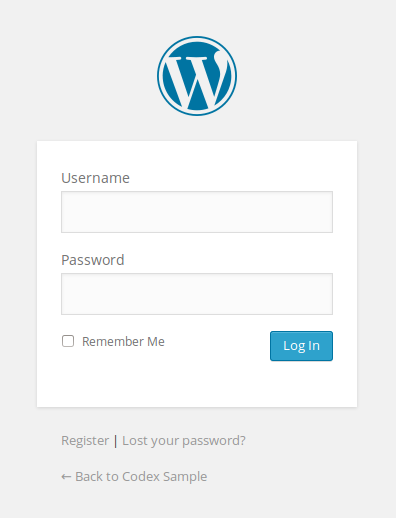

## Customizing the WordPress Login Page

The default WordPress Login page is so boring. A simple yet effective change you can do when building a client site on WordPress is update the login page with the company logo and brand colors. It's a nice touch that adds an extra "custom-built" feel to the site that your clients will see every time the access the site.




## First Ensure You Have Custom Logo's Enabled In The Theme

Add this to your `functions.php` file:

```php
add_action('init', 'jh_custom_logo_support', 10);
function jh_custom_logo_support() {
    add_theme_support('custom-logo');
}
```

## Changing The wp-login.php Logo

The next step is to replace the WordPress logo with whatever's set as the Custom Logo in the WordPress settings. Add this to your `functions.php` file:

```php
<?php
// Changes the /wp-login.php logo to the site's custom logo.
add_action('login_head', 'login_page_custom_logo');

function login_page_custom_logo() {

    $custom_logo_id = get_theme_mod('custom_logo');
    $image = wp_get_attachment_image_src($custom_logo_id, 'full');
    ?>
        <style>
            body.login div#login h1 a {
                background: url("<?=$image[0] ?>") center center / contain no-repeat;
                height: 25vh;
                width: 100%;
            }
        </style>
    <?php
}
```

Adding the following changes the text that's hidden visually, but readable by screen readers and search engine crawlers. By default, I just set this to the blog's name with the following:

```php
// Changes the SEO Text for the logo:
add_action('login_headertext', function () { return get_bloginfo('name') . " Login"; });
```

## Change The Logo's Link on the WP Login Page

By default, the WordPress logo links to WordPress.org. Thankfully, there's a hook available to easily change the link.

```php
// Changes the Logo Link to the Site's Home URL:
add_action('login_headerurl', function() { return get_home_url(); });
```

## Add Text to the Login Page.

If you also want to include some additional text between the logo and the form, you can do so with the `login_message` hook.

```php

// Adds an <h1> under the logo:
add_action('login_message', function () { return "<h1>" . get_bloginfo('name') . " Login</h1>"; });
```

{{{vert}}}


## All Together Now

Here's the whole script in one piece if you want to just copy-paste it into your `functions.php`:

```php
<?php
add_action('init', 'jh_custom_logo_support', 10);
function jh_custom_logo_support() {
    add_theme_support('custom-logo');
}

// Changes the /wp-login.php logo to the site's custom logo.
add_action('login_head', 'login_page_custom_logo');
function login_page_custom_logo() {

    $custom_logo_id = get_theme_mod('custom_logo');
    $image = wp_get_attachment_image_src($custom_logo_id, 'full');

    ?>

    <style>
        body.login div#login h1 a {
            background: url("<?=$image[0] ?>") center center / contain no-repeat;
            height: 25vh;
            width: 100%;
        }
    </style>
    <?php
}

// Changes the SEO Text for the logo:
add_action('login_headertext', function () { return get_bloginfo('name') . " Login"; });

// Changes the Logo Link to the Site's Home URL:
add_action('login_headerurl', function() { return get_home_url(); });

// Adds an <h1> under the logo:
add_action('login_message', function () { return "<h1>" . get_bloginfo('name') . " Login</h1>"; });
```

---

Cover Image By <a href="https://unsplash.com/@muratodr?utm_source=unsplash&utm_medium=referral&utm_content=creditCopyText">Murat Onder</a>
  