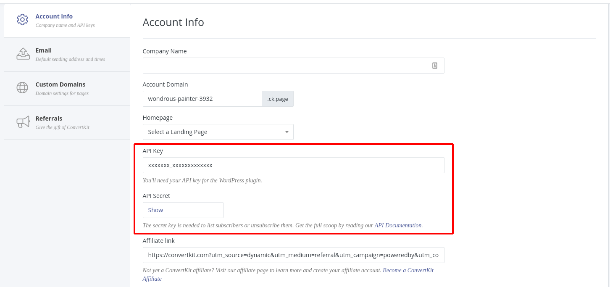

# Do you want to include the Subscriber Count from your [ConvertKit](https://convertkit.com?lmref=HnoQfg) Newsletter on your Gatsby.js Site?

If that oddly specific scenario applies to you then read on, and I'll show you just how to do it. 

If not, consider checking out [ConvertKit](https://convertkit.com?lmref=HnoQfg) anyway. They make it super simple to spin up your own Newsletter and start building out a mailing list today!

Displaying your subscriber count will allow you to take advantage of a psychological phenomenon called "Social Proof". Social Proof is the idea that if something is perceived as "popular", then that thing is worth paying attention to or checking out. By letting prospective sign ups know that you've got the attention of a bunch of other people, they're more likely to also sign up.

It's why things like those "John Smith in Bumfuck, Nowhere just Purchased our Product" popups, and "15 Other People are Looking at this item right now" messages are so popular and prevalent among e-commerce stores. They create a sense of urgency and stokes that "I want to be one of the cool kids" feeling we all seem to have.

I'll leave the psychology to the psychologists, let's dive in.

## Get API Keys from [ConvertKit](https://convertkit.com?lmref=HnoQfg)

The first thing you need to do is get your account's API keys from [ConvertKit](https://convertkit.com?lmref=HnoQfg). They're located under `Account Settings > General`:



To store your keys securely and away from prying eyes, we're going to take advantage of Environment Variables. If you don't already use them, create a `.env` file in the root of your Gatsby project, and paste this block of code in there:

```
CONVERTKIT_KEY=xxxxxxxxxxxxxx
CONVERTKIT_SECRET=xxxxxxxxxxxxxxxxxxxxxxxxxx
```

Replace the `xxxx`'s with your corresponding API Key and API Secret.

## Security

Make sure to include `.env` in your `.gitignore` file so you don't check in your keys to your Git Repo. If someone were to get access to your API keys it would be the same as them having your username and password. They can control any part of your account and send a bunch of spam emails to your list. If you're using some sort of Continuous Deployment (CD) setup, you'll also need to include your Keys as Environment Variables according to your specific CD tool. 

{{{vert}}}

## Make The Call

In accordance with the bit above about security, we don't want to expose our API Keys to the public. The beauty of Gatsby and other Static Site Generators is that you can do things at build time instead of at run time or "in the browser". This keeps the Keys locked away behind your CD tools "Secrets" and away from the snooping eyes of the public.

For this purpose we're going to take advantage of the `gatsby-node.js` file in the root of our site. If you are unfamiliar with how Gatsby Builds, a part of the process includes running the `gatsby-node.js` file once. You can use this to create pages dynamically, add/modify nodes on your GraphQL tree, and more. This is where we're going to hit the [ConvertKit](https://convertkit.com?lmref=HnoQfg) API.

First things first, you'll need to install `node-fetch`:

```bash
yarn add node-fetch
```

Then require it at the top of `gatsby-node.js`:

```js
const fetch = require("node-fetch")
```

After everything else in that file (if there is anything) create a new asynchronous function called `getSubscriberCount`:

```js
async function getSubscriberCount(ck_secret, ck_key) {
    // Where the magic happens...
}
```

## Now This Is Where The Fun Begins

Here's the meat of the `getSubscriberCount` function. We're using `node-fetch` to "fetch" the subscriber count from the [ConvertKit](https://convertkit.com?lmref=HnoQfg) API. We include the [ConvertKit](https://convertkit.com?lmref=HnoQfg) keys as Parameters to the function and then pass them as URL Parameters to the `/subscribers` endpoint.

```js
async function getSubscriberCount(ck_secret, ck_key) {
  return fetch(
    "https://api.convertkit.com/v3/subscribers?api_key=" +
      ck_key +
      "&api_secret=" +
      ck_secret
  )
    .then(response => response.json())
    .then(data => {
      console.log({ convertkitRes: data })
      return data.total_subscribers
    })
    .catch(err => console.error(err))
}
```

Once we get a response from ConvertKit, we convert that response to a useable JSON Object, write the value to the Log for debugging purposes and then return the specific data we needed. 

Now anytime you call the `getSubscriberCount()` function it will return your current subscriber count. You can then call this around your `gatsby-node.js` file as needed. 

## Pass The Subscriber Count To Your Pages

When you generate pages in `gatsby-node.js` you're able to pass data down to the page template in the form of Page Context. First we pull in our [ConvertKit](https://convertkit.com?lmref=HnoQfg) Keys with `dotenv` and pass them into our fancy new `getSubscriberCount()` function.

```js
const { CONVERTKIT_SECRET, CONVERTKIT_KEY } = process.env
const subscriberCount = await getSubscriberCount(
      CONVERTKIT_SECRET,
      CONVERTKIT_KEY
    )
```
Then, when you call Gatsby's `createPage` to actually generate your pages you just pass in your subscriber count through the `context` object:

```js{5}
createPage({
    path: "/newsletter/",
    component: path.resolve(`src/templates/newsletter.js`),
    context: {
        subscriberCount: subscriberCount,
    },
})

```

## Using Page Context to Display Your Subscriber Count

Now that our Newsletter page gets generated with access to our Subscriber count let's modify the page template to include it. In my case the template file is `src/templates/newsletter.js` but pick whichever page your trying to modify.

Page templates in Gatsby are just React Components that receive some data through Props and output JSX to be compiled to HTML at build time. 

Check out this example Functional Component:

```js
import React from "react"

const Newsletter = ({ pageContext }) => {
    let { subscriberCount } = pageContext

    console.log(subscriberCount)

}

export default Newsletter
```

All this is doing is destructuring the `pageContext` variable out of the Props, and then further destructuring `pageContext` to get the `subscriberCount` variable we passed in earlier. 

You can further simplify this with a process called nested destructuring:

```js{4}
import React from "react"

const Newsletter = ({ 
    pageContext: { subscriberCount } 
}) => {

    console.log(subscriberCount)

}

export default Newsletter
```

In this case the `pageContext` variable is never assigned since all we need from it is the `subscriberCount`. Keep in mind that if you use nested destructuring to extract a variable out of an object the original variable is never assigned. If you need more than one thing out of the `pageContext` variable you need to destructure both variables at the same time: 

```js{3}
const Newsletter = ({
  data,
  pageContext: { recentEmails, subscriberCount }
}) => {
```

## Show OFF!

Now that we have our `subscriberCount` assigned to a variable in our page template, all that's left to do is put it somewhere in our JSX. You can either output it directly in the template:

```js{5}
const Newsletter = ({ pageContext }) => {
    let { subscriberCount } = pageContext

    return(
        <h2>Join {subscriberCount} Other Subscribers TODAY!</h2>
    )

}
```

or pass it down as a Prop into a different Component:

```js{5}
const Newsletter = ({ pageContext }) => {
    let { subscriberCount } = pageContext

    return(
        <Counter count={subscriberCount} />
    )

}
```

## That's All Folks

Now you're able to access your [ConvertKit](https://convertkit.com?lmref=HnoQfg) Subscriber count from anywhere on your Gatsby site, safely and securely! 

The one downside to this method is that your published subscriber count will only update when you build the site, but maybe you can use that as motivation to post more content. 

## Take It Even Further

Some suggestions for taking this tutorial further:

* An alternative option to explore if you need that number _all over_ would be adding it as a node on your GraphQL tree instead of using Page Context. Then you could request it in any GraphQl Query you make.
* Automate your CI/CD process to either rebuild the site daily or listen for a ConverKit Webhook to rebuild the site on every new subscriber.

Let me know on Twitter [@JackHarner](https://twitter.com/jackharner) if you have any questions or implemented any part of this yourself! I'd love to see it!
---

#### Featured Image by <a href="https://unsplash.com/@nhillier?utm_source=unsplash&amp;utm_medium=referral&amp;utm_content=creditCopyText">Nick Hillier</a> on <a href="https://unsplash.com/s/photos/number?utm_source=unsplash&amp;utm_medium=referral&amp;utm_content=creditCopyText">Unsplash</a>