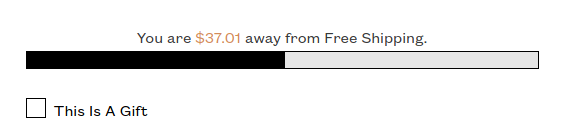

Now that June is in the books and things have pretty much settled, I'm getting into my new routine and I'm LOVING it. 

<blockquote class="twitter-tweet">
My <a href="https://twitter.com/hashtag/Freelance?src=hash&amp;ref_src=twsrc%5Etfw">#Freelance</a> Morning Routine has evolved into:   * Wake Up * Make Coffee * Admire my plants for an hour * Get to work  I love it so much. No more rushing around in the morning before work.
&mdash; Jack Harner 🚀 Freelance Web Dev (@JackHarner) <a href="https://twitter.com/JackHarner/status/1409582871757479939?ref_src=twsrc%5Etfw">June 28, 2021</a></blockquote>

I basically just wake up whenever, take my time enjoying my coffee, and then settle into work when it feels right. Not having to rush around in the morning has to be my favorite thing about living the Freelance Life so far.

## Multiple Part Time Jobs

Now that I'm freelancing full time, instead of living Paycheck to Paycheck, I'm living Invoice to Invoice. It's an interesting difference because instead of 2 "big" paychecks a month, I'm getting a dozen or so small to medium sized payments. Spreading myself out across these multiple part time jobs has allowed me to stay busy even when there's nothing from one job, because there's plenty to do from the rest.

> Managing all of that sounds complicated, right? It doesn't have to be. I'm working on writing up an in-depth review of [Bonsai](https://bonsai.jackharner.com), the freelance accounting tool I've been using to manage my time tracking and invoices. It's definitely making payday easier, so stay tuned for that! 

Working with multiple clients at once is great because if I'm running into a productivity brick wall on one client, I can get up, take a little walk, and sit down fresh on a different project. Switching it up multiple times a day keeps my mind fresh and it never feels monotonous.

## On The Road to Passive Income

Freelancing has provided me with multiple income streams, however they're not passive income by any means. I'm still technically trading my time for money. Now that the side (nights and weekends) work that I was doing, pre-freelance, has become my main work, the side-side-hustles can become the side job. I've made some significant progress on Simple Tweets, and am hammering out the details for a few different e-commerce opportunities.

{{{vert}}}

## Started with Electric Eye

I started my first project with a new client, [Electric Eye](https://electriceye.io/), this month! Electric Eye is this fully remote Ecommerce Agency specializing in building and optimizing DTC Brands with Shopify.

They had me do a (paid) take home test to see if I knew my way around a Shopify theme. I knocked it out in less than the allotted time and they said I did "the best out of any of [their] applicants to date". 

I spent a little time getting onboarded with the team and then got tasked my first project. It was just some simple layout changes to the cart for one of their clients, and building out a "Free Shipping Progress" Bar: 

I'm super stoked to have the opportunity to work with them and I can't wait to see what else I get to build!

## It's Paying The Bills!

2nd month in a row I was able to get everything paid for with just my Freelance income. I have a few months of savings leftover after the move, but luckily I haven't needed it!

Just gotta keep working, keep finding new clients, and spend less than I make. Easy.

## Create More. Consume Less.

I spend hours scrolling through Twitter, how come I struggle writing tweets? It's because I'm consuming more than I create. The only way to get better at anything is to JUST DO IT. I need to blog more, I need to tweet more. The more you create, the more you can share, and the more you feed the algorithm, the more it regurgitates your stuff to other people. Feed the beast, but be the bait, not the meal.

> ### Creation > Consumption.

### 👋 See you Next Month

#### But in the meantime, [Follow me on Twitter](https://www.twitter.com/jackharner)!
