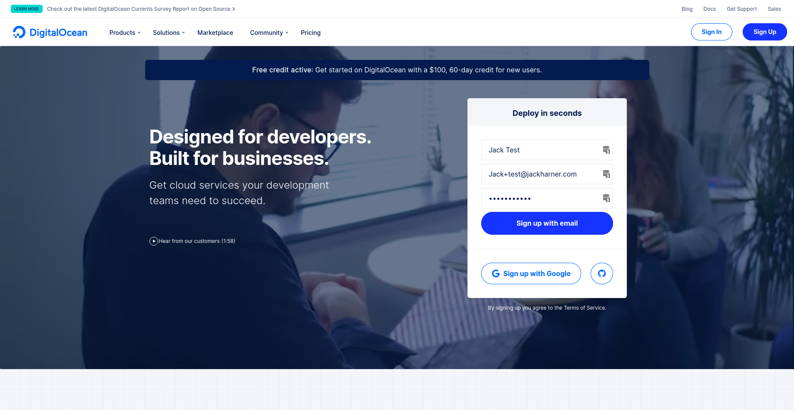
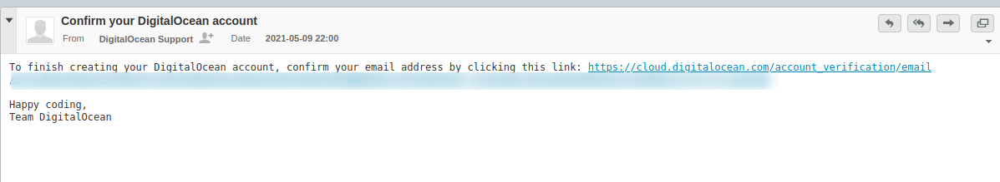
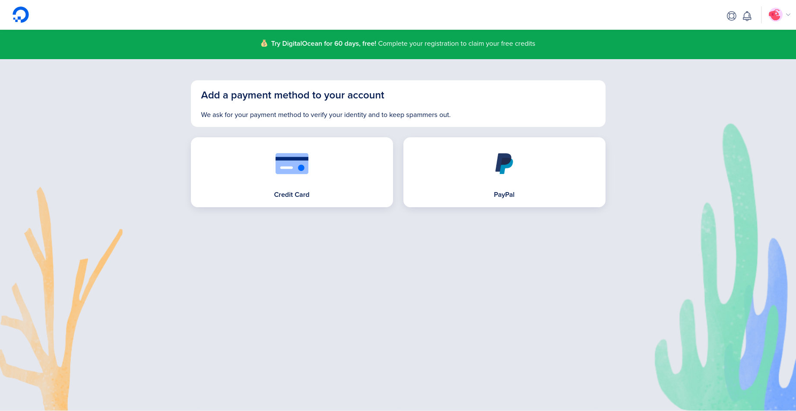
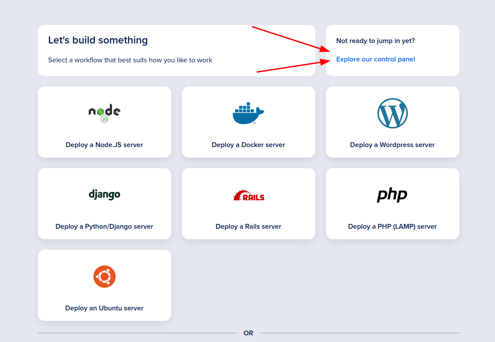
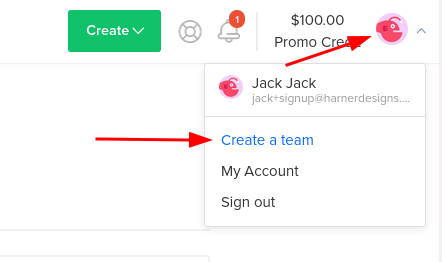
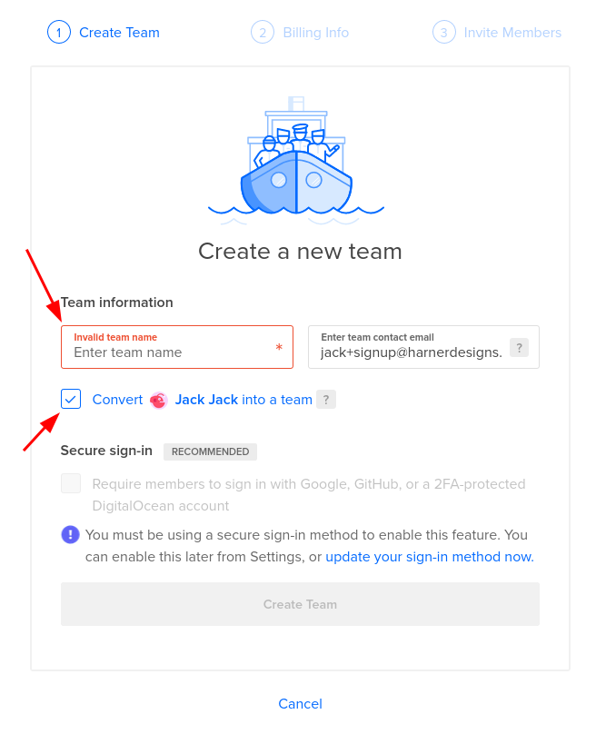
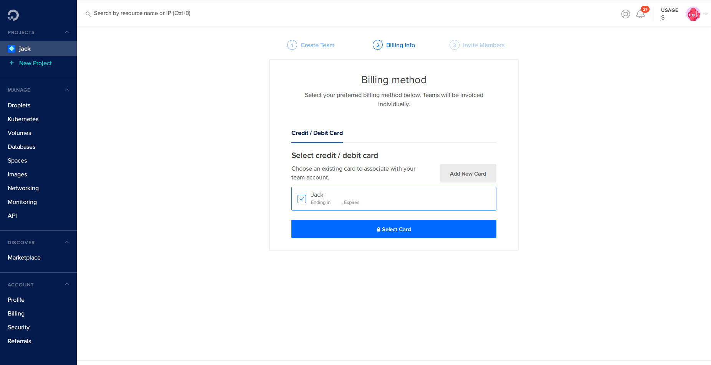
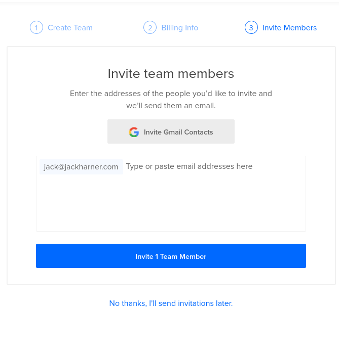

[DigitalOcean](https://m.do.co/c/66cca12b82bc) is a cloud infrastructure company based in New York City. They have blazing fast data centers all over the world and are my personal favorite hosting provider. I point all of my clients there and anytime I need a server or any kind of hosting, DigitalOcean is where I go. Spin up servers in a couple of clicks and you're on your way! 

Today I'm going to go over how to get your DigitalOcean account setup, create a team, and grant me access to get your site setup.

> On the off chance that you got here through Google or elsewhere and you're not already a client of mine, please [Get In Touch](/contact). I will gladly help you get something hosted on DigitalOcean.

## Setting Up Your DigitalOcean Account

Click the button above (<a href="https://m.do.co/c/66cca12b82bc" target="_blank" rel="noopener noreferrer">or Here</a>) to get started signing up for DigitalOcean. 

Enter in _your_ name, _your_ email, and choose a strong Password. Then click on **"Sign up with email"**.

Alternatively you can sign up with Google, or use an existing GitHub account.

## Verify Your Email

They should send you an email with a link. Open it and click on the link to verify your email.

## Add A Payment Method

Next you're presented with the option of adding a Credit/Debit card, or connecting a PayPal account. 

Pick Your Poison and follow the prompts to connect your payment method.

After you're done adding a payment method it takes you to a screen to help you get your first thing setup. Ignore this for now, and just click on **"Explore Our Control Panel"**.

## Creating A Team

DigitalOcean comes with the ability to create Teams. Teams allow you to share Droplets, Domains, Images, Volumes and pretty much everything else with multiple people, all while keeping the payment info stored securely in the owner's account. 

### Let's Just Jump Into It.

In the upper right hand corner of the page, click on your little profile picture (or whatever default icon you got). 

Click on **"Create A Team"**.

### It's All In The Name 

Type in your team name and either change or verify the "Team Contact Email". That email is where all the team related billing and alert emails will go. 

> Selecting "Convert ____ Into A Team" will move over any existing Droplets, or other DigitalOcean products to the new team. If you're starting with a fresh DigitalOcean account, this is fine. 
> 
> Don't select this if you have existing Droplets you want to keep separate from the new Team.

If you'd like to require all users on the team to use 2FA or some other form of secure login, check the box under **"Secure Login"**. (You have to setup 2FA on your own account before you're allowed to require it for the team).

Click on **"Create Team"**

### Dolla Dolla Bills Y'all

On the next page select (or add) your preferred Payment Method for the Team. This payment method will be used for all charges accrued on the team, but members of the team _will NOT_ have access to your payment info. 

### Invite Time

The next page is where you can invite everyone you want to give access. Enter in 1 Email per line. Those emails will get an invite to either create a DigitalOcean account, or connect an existing one to the team. 

If you were sent this so I can get your hosting account setup for you, please invite `hello@jackharner.com` as a team member.

> **REMEMBER** - Anybody you invite to your team can spin up and destroy servers or anything in the account. Be careful who you give access. 

## That's All Folks

Now that you've given me access, just sit back and relax and I'll get the rest of your account setup per our discussions. 

If you're not one of my clients and you need help getting something hosted online, [Get In Touch](/contact) and I'll gladly get you setup and hosted with DigitalOcean.