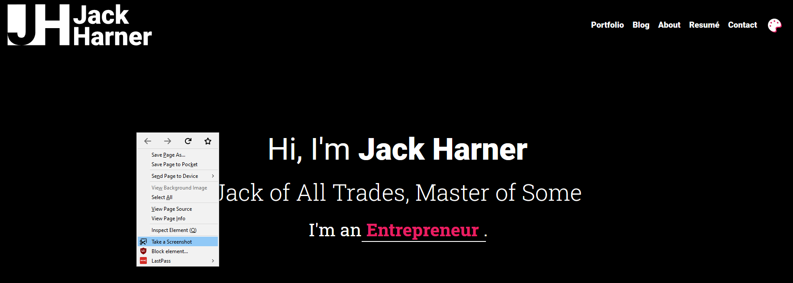
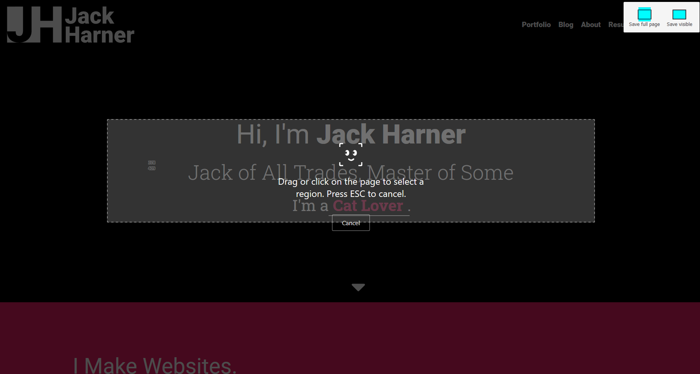
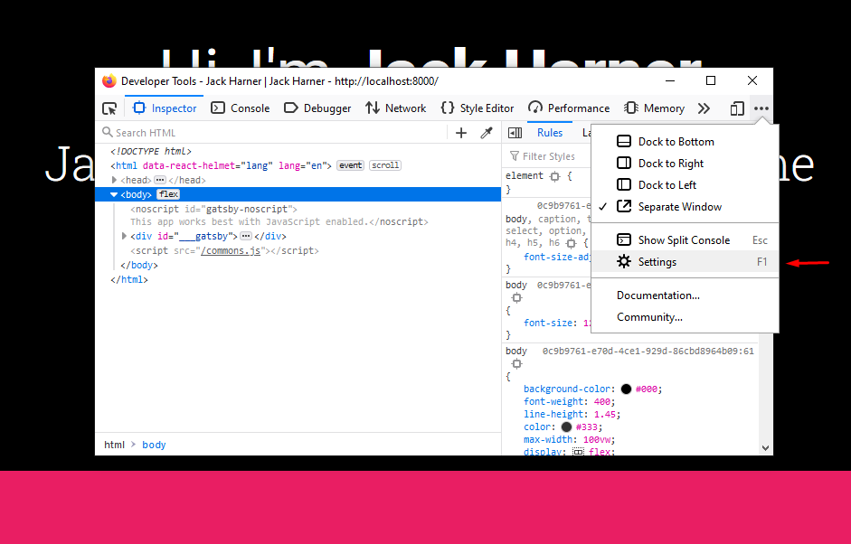
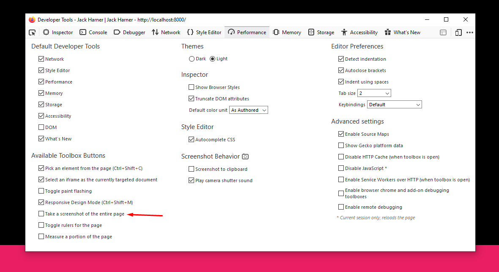
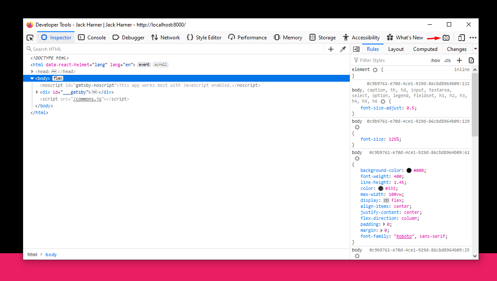

There are several ways to take a screenshot in Firefox. 

## Right Click Context Menu

First up you want to Right Click anywhere on the page and select "Take a Screenshot".



This will pop up Firefox's built in screenshot tool. It allows you to select specific elements, just what's visible on the page, or the full page. Highly useful for taking screenshots of specific components or if you just need a quick capture. 



## Developer Tools

The second way you can take Screenshots in Firefox is through the Developer Tools. The first thing you'll need to do for this one is turn the Screenshot button on in the Settings. 

Open the Developer Tools with `F12` or `Ctrl + Shift + I` and click on the three dots in the upper right hand corner.



Once you have the settings open you'll need to enable "Take a screenshot of the entire page" under "Available Toolbox Buttons".



What that does is adds a Camera button to the Developer Tools Toolbox Buttons, next to the settings button you used earlier. Click on it and it will take a Full Page screenshot of whatever page you opened the Developer Tools for. It saves the files in your default Download folder with the current timestamp.



{{{vert}}}

## Bust Out The Big Guns

> Need to take some massive (>2,000px wide) screenshots? 
> 
> Well then, _**It's Console Time!**_

Hit `Ctrl + Shift + K` or `F12` to open up the Firefox JavaScript Console. Firefox has a decent set of commands that you can run that interact with the Browser itself instead of the webpage. `:screenshot` is one of them.  If you type `:screenshot` into the console and hit `Enter` it will take a snapshot of the currently visible viewpoint.

If you want a higher resolution screenshot than your monitor can provide, you need to set the `--dpr` flag. DPR Stands for Device Pixel Ratio, so setting `--dpr 2` tells Firefox to capture the image at 2x the resolution of the viewport (2x your monitor resolution, basically).

```
:screenshot --dpr 2
```
> Be careful, setting the `--dpr` flag to anything higher than `3` will generate **MASSIVE** screenshots and will take a while and a lot of hard drive space.

If you need to screenshot the full page, you just need to add the `--fullpage` flag. 

`:screenshot --dpr 2 --fullpage` will take a full page screenshot of the current page at 2x the resolution it is displayed at. 

---


Go get them nice & fat portfolio screenshots of your work and send me a link on Twitter, [@JackHarner](https://twitter.com/jackharner). I'd love to see what you're working on!
