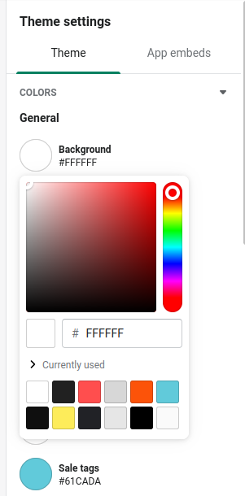
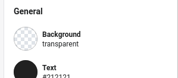

Shopify sections make it super easy to add customizable settings that your clients can control with a wonderful user-friendly UI.

One of the many settings types available to Shopify Sections is the Color Picker:



One slightly annoying part about the Color Picker is that if you set the field to blank in the customizer: 



The specific setting won't actually be null or a falsey value, it returns as `rgba(0,0,0,0)`. Which means: 

```liquid

     
        This will always be true. 
    

     
        This will never render. 
    

```

## The Solution

The color picker stores the setting and returns a Shopify [Color Object](https://shopify.dev/api/liquid/objects/color) which allows us to check whether or not a color is visible at all. 

```liquid

    
        Color Setting is set
    

    
        Color Setting is blank / transparent.
    

```

This treats `rgba(255,255,255,0)` the same as `rgba(0,0,0,0)`. If a color has a 0% alpha, no matter the Red Green or Blue values, the color won't be visible. 

--

Photo by <a href="https://unsplash.com/@steve_j?utm_source=unsplash&utm_medium=referral&utm_content=creditCopyText">Steve Johnson</a> on <a href="https://unsplash.com/s/photos/rainbow?utm_source=unsplash&utm_medium=referral&utm_content=creditCopyText">Unsplash</a>
  