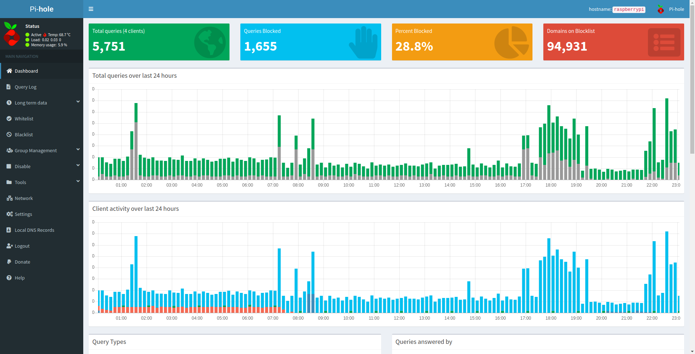

After wanting one for some time, I finally caved and bought a [Raspberry Pi](https://www.raspberrypi.org/). I got the Pi 4 Model B, the latest and greatest. It boasts the ability to replace your desktop computer, with two micro-HDMI outs as well as on-board wi-fi and 4 USBs. Seeing as a lot of stuff I do needs a lot of processing power, I doubt it will be replacing mine, but I'm excited to see what I can do with it!

## PiHole - Block ALL THE ADS.. Sort of..

If you're not familiar, [PiHole](https://pi-hole.net/) is a lovely piece of software that can act as a network-wide ad-block for your entire house. Hypothetically super simple to set up: Install Raspberry Pi, Run a Bash Script, Set your router to use your Pi as the DNS server, and you're done. 

For me, it turned out not as simple. I use the stock Router/Modem Combo provided to me by Comcast. Turns out, they don't allow you to set custom DNS servers for the network. Great. So now I have to go around and configure each device manually to use the Pi as it's DNS server to get it to work. 

{{{vert}}}

> ## It's Always DNS.

I've been meaning to buy my own router/modem for a while now, and this might be what finally pushes me over the edge. 

## What's Next

* I've got a couple different [BlueSky bots](https://twitter.com/git_shit) and such running on different servers that I might try to consolidate to the Pi. I got the 2Gb Memory version so it's not SUPER powerful, but for simple cron tasks and things it could save me some money.
* Buy a new Modem/Router combo. 
* Buy a set of [Raspberry Pi Fans](https://www.amazon.com/Raspberry-iUniker-30x30x7mm-Brushless-RetroFlag/dp/B076H3TKBP/ref=as_li_ss_tl?crid=1UZQNS98RC9CW&dchild=1&keywords=raspberry+pi+4+fan&qid=1590980965&sprefix=raspberr,aps,211&sr=8-3&linkCode=ll1&tag=harner-20&linkId=88de087ae5089f3b764b5d3775643efc&language=en_US) to help deal with the heat. It hovers right around 66&deg;C. with just PiHole running, but I'm sure that will jump up once I start using it for other things.
* I also had an idea for a lightweight web app that I could host on the Pi and use QR codes to track how often I water my plants. This one's probably way down the line, but could be a cool open source project to work on. 