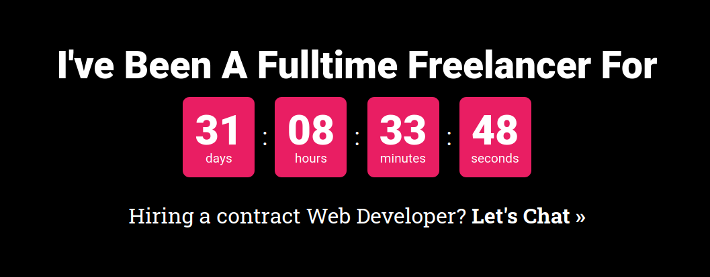
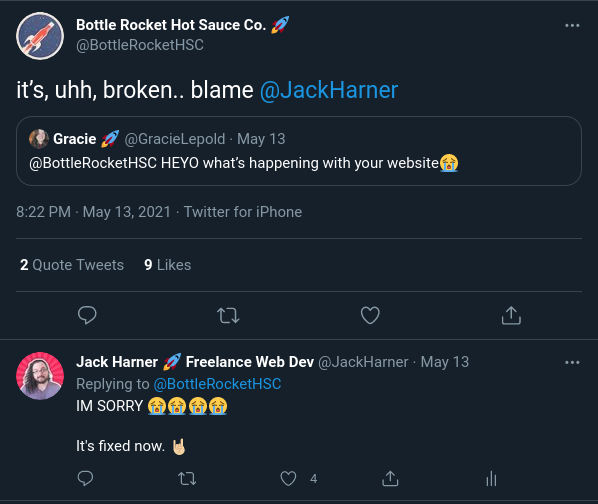
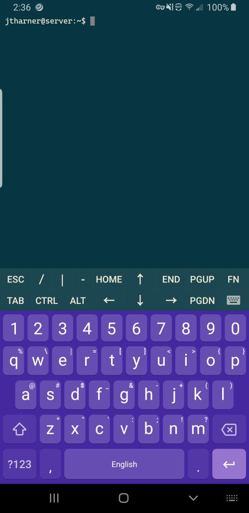

## It Finally Happened:

## The End Of An Era

My last official day at my 9-5 was April 30th. After working there for almost 5 years, it was definitely a bittersweet ending. 

My bosses had known about my exit for the better part of 6 weeks, and that time *FLEW* by.

I don't really know why, but telling them was the most nerve wracking thing I feel like I've ever done. Right before telling our GM, I had the closest thing to a panic attack I've ever experienced. I was just standing in our office's kitchen, my heart beating at 150 BPM (Thanks Galaxy Watch for telling me to "Calm Down") and my whole body shaking. 

I knew I just had to rip the Band-Aid off. The clock was ticking down and it wasn't going to get easier.

## I'm Moving, But...

Obviously, I was way overthinking the whole "telling my boss" situation. Hindsight being what it is, I know I was worked up over how important my work was to that business. There was some significant downsizing at the start of COVID, and a lot of essential day-to-day warehouse tasks fell to me. I was fortunate to still have a job, but boy was it stressful.

The conversation with my boss went better than I could've hoped. I let her know that I was burnt out, both with the job and with New Mexico. I'd been living there for 26-ish years and it was absolutely time for a change. I was ready to dive full time into freelancing and tying that into my move to Denver sounded perfect to me.

I reasoned that a lot of the work they had actually hired me for didn't *have* to be done in the warehouse. Graphic Design, Web Dev, Software Dev, and Marketing are prime task categories for Remote work. All we had to do was shuffle some of the warehouse tasks to the few people we did bring back, and anything that I couldn't pawn off that I could do remote I would continue to do. Easy.

She was onboard with my plan and even offered to discuss it with the owners for me. A HUGE relief because I probably would've had the same pre-convo panic attack at least once, if not twice more. Overall she was happy for me, and excited for the next chapter in my life.

They agreed to let me switch over to being a contractor, and to continue doing what I could from Denver. That was a huge weight of my shoulders knowing I had yet another client to rely on to get my bills paid. 

I spent basically the last month preparing them and the warehouse so that I could update software remotely, debug issues on some of the computers remotely, and making sure I had access to everything I needed from anywhere. 

My last day finally rolled around, and with some weird cosmic timing, someone had broken into the warehouse that morning. 2 Guys literally just walked up, kicked our glass front door in, and ran off with only like $100 worth of shoes and some clothes. Spent the first half of my last day scrubbing through our security cameras to see if they caught anything the cops could use. 

I was only working a half day since I had plenty of moving stuff to deal with, so my boss brought in lunch for everyone. We ate, had a last "mobile happy hour", I said some tearful goodbyes, and then I left.

## Moving To Colorado

If there's one thing I learned about moving from moving to Colorado, it's this:

> <h3 style="text-align: center;">FIGURE OUT THE NEW HOUSING SITUATION BEFORE YOU TELL YOUR CURRENT PLACE YOU'RE LEAVING</h3>

My roommate and I got approved for the apartment **16 hours** before I had planned to leave Albuquerque with a truck full of all my stuff. SIXTEEN HOURS!

Let me tell you, that is not the way to go about moving states. Our housing plans changed about 5 times in the last few months we were planning this whole thing. What was initially going to be a 4 Bed, 3+ Bath house with 4 roommates, rapidly became a 2 bed 2.5 bath apartment between me and my best friend [Clinton "I'm Not A Chef" Day](https://www.youtube.com/channel/UCivxFHGyZy66hA3DV95rL9w). 

Going from one stressful situation to the next, we got the apartment, had a brief moment of untapped joy, and then the panic that I had too much shit that wasn't all going to fit set in. Apparently, my dad has played nothing but Tetris since he was a kid because he got way more in the truck than I expected. The too small truck ended up being a blessing, though, because it forced me to leave behind some stuff I was having trouble letting go of.

Just a quick 6.5 hour drive later, and we made it to the new place. 

## DOG BITE

On my 5th full day in Denver, I was bit by a dog and had to get 12 stitches in my nose.

Some "Welcome to Denver", right?

Given what happened, I'm still very fortunate. It was millimeters away from my septum piercing, inches away from my eyes, and could've been a whole lot worse.

It's already healing up really well. I got the stitches out about a week ago, and the scab has totally fallen off. I'm not too worried about the scar. If anything, it's a nice segway into a wild ass story to share at parties.

{{{vert}}}

## Fixing Bugs In Production From My Phone At A Brewery

Colorado has an absolutely insane craft beer scene. As an avid consumer of craft beer, any time my roommate suggests a new spot, I'm pretty much always down to go. The spot this time was called Bruz Beers, a traditional Belgian-style specializing brewery in Midtown.

I'm still not exactly sure what happened, but I managed to publish the only just-started update to [Bottle Rocket Hot Sauce's site](https://bottlerocketsauce.com), overwriting V1 on the Live Site. 

...

Completely and totally breaking the site.

My dilemma was that I was at least 30 minutes away from my computer, and we were already had plans to go get some delicious pizza. 

### The Pizza:

<em>Don't ask me what was on it, but it was SO good.</em>

Luckily I had an SSH Client already setup on my phone (Let's see your iPhone do that) so I was able to: 

1. SSH into one of my web servers
2. Clone the Bottle Rocket theme repo to that server from the `main` branch
3. Setup Shopify's ThemeKit
4. Re-deployed the V1 version of the theme.

All of that on this tiny little terminal on Bruz's patio while the sun set: 

So far, that's been the most "freelance" thing I've experienced, and it just shows that I'm prepared to fix anything at any time. Maybe I am cutout for this whole freelance thing after all!

## Biggest Challenges So Far

> ### I am my own boss, there's no one telling me what to do!! 😀😀
>
> ### I am my own boss, there's no one telling me what to do.. 😱😱

This one is both a blessing and a curse. When I first moved up here I made it a big deal to delete all of my alarms.

"I'll wake up when I WANT to wake up" I told anyone who would listen. 

I still woke up at 7 the next morning. 

After about a month I pretty much get my day started around 8:30. Take my time getting coffee or whatever else for the morning and typically sit down to work around 10. Love that for me.

However...

The only thing forcing my ass into the chair is the dwindling of my bank account and the loom of impending homelessness (or worse, moving back to Albuquerque). Which you'd think would be the best motivator, right?

I'm getting the hang of it, but it's definitely something to get used to.

> ### My Income Is Now Like An Arcade High Score

Since going fulltime freelance I switched my invoicing and time tracking software over to [Bonsai](https://www.hellobonsai.com/invite?fp_ref=jackharner). I wanted something that could handle both time tracking as well as invoicing and payments. I'm going to write up a full review here soon, but so far I love it.

One thing it does, is it puts both your unbilled hours and the money expected from those unbilled hours right on the dashboard. I'm working with a couple of clients in a "do work. invoice twice a month" capacity, so I'm directly incentivized to get that unbilled hours number as high as possible.

I can already tell that's going to turn me into a workaholic. 

## Key Takeaways from Month 1

* My nose is not dog proof.
* I am the only one in charge of making sure I get my work. 
* Twitter continues to be my most profitable network, as far as getting clients.
* Prioritize creating content over consuming content.

> ### I might turn this into a monthly series following my Freelance career. Hit me up on [Twitter @JackHarner](https://twitter.com/jackharner) if you want to see more like this!