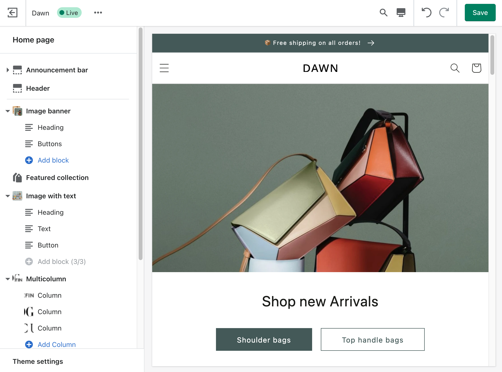
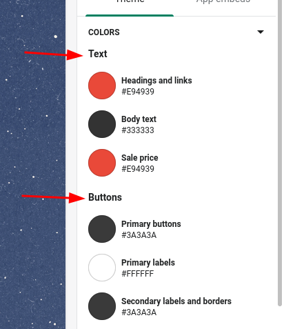
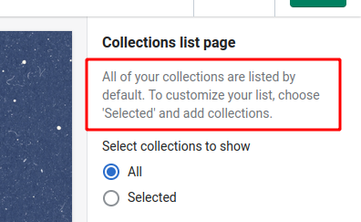
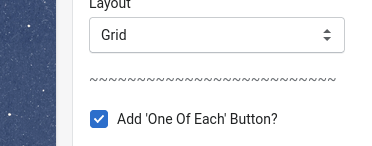
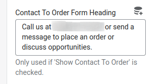

Shopify is the most customizable e-commerce platform, while still being super user friendly out of the box. Like yes, hypothetically you can build literally anything you wanted if you built it from scratch, but who's got the time for that?! (Let alone maintaining it??) Shopify gets you about as close as you can get to the "build it from scratch" level of flexibility, while still letting you hand the store off to the less technically inclined users that will be running it on the day to day. 

The theme editor, & sections (+ specifically the introduction of [Sections Everywhere](https://twitter.com/shopify/status/1409922304738484229?lang=en) ) really opens the doors for hyper customizable Shopify themes, and dynamic e-commerce experiences across the site.



## With Great Customization, Comes Great Responsibility

Just because you *can* turn everything into a Block, Section, or Theme setting doesn't mean you *should*.

But if you're going to anyway, you better keep things organized and descriptive. I'm going to show you how to use the `header`, and `paragraph` settings, as well as the `info` setting property to make it perfectly clear what each setting changes.

## Section Settings Background

If you're unfamiliar, Shopify Sections are reusable blocks of code that can be modified, updated, & reordered by anybody with access to the Shopify backend. 

You define the settings and blocks available to each section with a JSON object inside of the ` ... ` tags.

For example, you'll see something like this at the end of most files in the `/sections/` directory: 

```liquid

{
    "name": "Coolest Section Ever",
    "settings": [ 
        ...
     ],
    "blocks": [ 
        ...
     ],
}

```

The settings inside the `settings` array are displayed in the order you write them, from top to bottom down the file. 

## The Header Setting

Use the header setting when you want to group or separate a collection of settings. As is probably obvious based on the name, it creates a Header with the text from the `content` property and creates a bit of separation between the settings above and below it.



Just add the following block in between the settings you want to add:

```json
{
  "type": "header",
  "content": "Header Text Content"
},
```
This works inside of Section, Theme & Block settings arrays.

## The Paragraph Setting

Use the paragraph setting when you want to add some additional context to a group of settings. (If you're trying to expand on a single specific setting use the Info property below.)



```json
{
  "type": "paragraph",
  "content": "Lorem ipsum dolor sit amet."
},
```

You can include links in Markdown style if you need to provide additional context and resources:

```json
{
  "type": "paragraph",
  "content": "Lorem ipsum dolor sit amet. [Here's a link](https://jackharner.com)"
},
```

If you really want extra separation between sets of settings, create a paragraph setting and set the text to either `-`, `=`, or my personal favorite: `~`.

```json
{
  "type": "paragraph",
  "content": "~~~~~~~~~~~~~~~~~~~~~~~~~~"
},
```




## The Info Property

Another way to provide even more specific clarity is through the info property. 

Every [Input Setting](https://shopify.dev/themes/architecture/settings/input-settings) type, can accept the info property which adds a little bit of text directly under the input.



```json
{
  "type": "checkbox",
  "id": "predictive_search_enabled",
  "label": "Enable product suggestions",
  "info": "This will also affect the search bar on the search results page.",
  "default": true
},
```

## ORGANIZE ORGANIZE ORGANIZE

Putting these three puzzle pieces together will give more context to and help your clients understand the different settings throughout the theme. The more they understand, the less they're going to take up your time with content changing questions.

# Stay tuned for more Shopify Tutorials, Tips & Tricks! 

## Further Reading

* [Shopify Docs on Sidebar Settings](https://shopify.dev/themes/architecture/settings/sidebar-settings)
* [Shopify Docs on Input Settings](https://shopify.dev/themes/architecture/settings/input-settings)