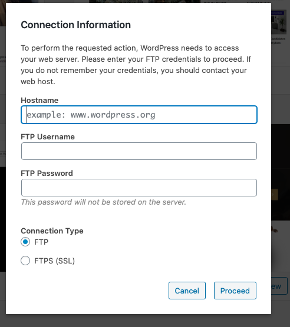

This is primarily just a reference for myself. Somehow I continuously run into File Permissions Issues while working with WordPress. For whatever reason, things can get pretty hectic, and you've probably ran into a similar issues if you ever get a "Permission Denied" error, or if WordPress asks you for your FTP Connection Information to update a plugin. 



Sometimes it's just best to reset everything back to the way Apache needs it to be to run smoothly: `775` on folders, and `664` on files.

Run the following 3 commands from the root of your WordPress install (the folder containing your `wp-config.php` file): 

```bash
chown www-data:www-data -R * # Set Apache's www-data user as the owner
find . -type d -exec chmod 775 {} \;  # Change folder permissions to rwxrwxr-x
find . -type f -exec chmod 664 {} \;  # Change file permissions to rw-rw--r--
```

I'm sure future me is thanking "now" me for writing this down so I can stop googling it. You're welcome future me!