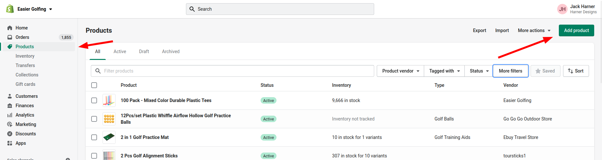
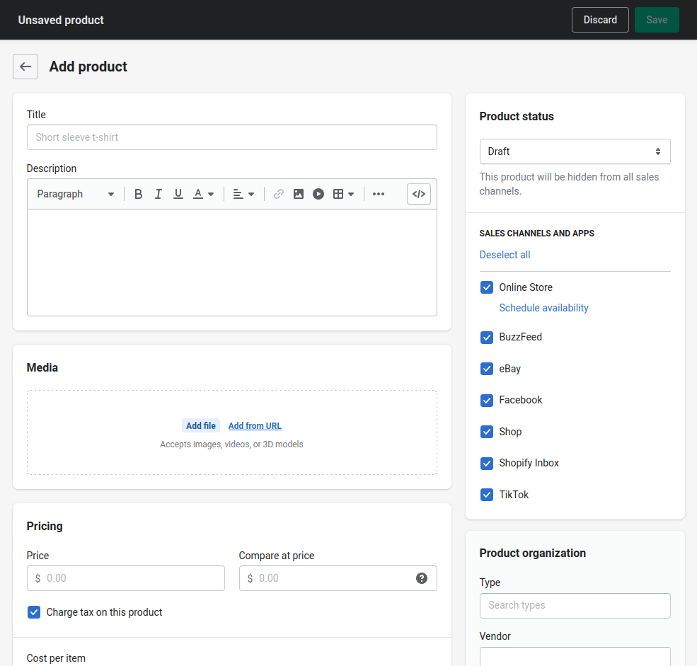
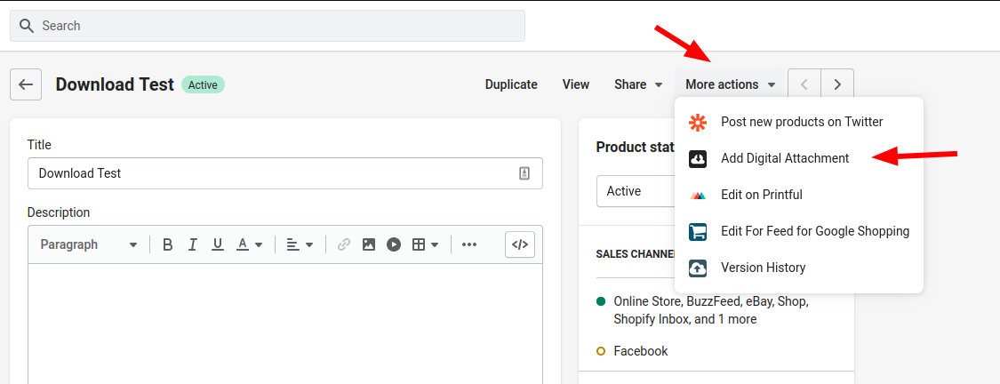
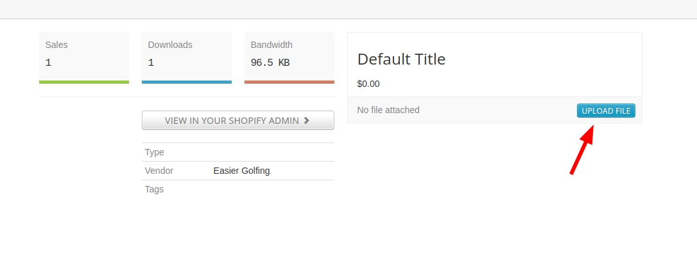

## How to add a digital product to your Shopify Store

1. Go to Products and then Click on Add Product

2. Fill out all the product info, but DON’T upload the PDF to the media section. You’ll do that in the next step.

3. Save the product (you can leave it in Draft status if you want)
4. Click on More Actions and then “Add Digital Attachment”

5. Click “Upload File” and upload the PDF

6. Publish the product when you’re ready. 👍🏽
