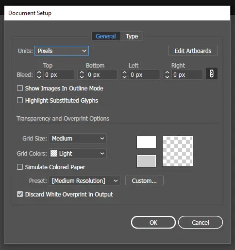

Sometimes when you're working with [graphic design](/blog/tags/graphic-design) you end up working on a piece that's meant to be displayed on a non-white background, like a logo or web icon. Unfortunately, there isn't really a way to set the background color of an artboard in Adobe Illustrator, but let's look at a few workarounds that achieve the same effect.

## The simplest way

The simplest, but probably not the best way of accomplishing a colored background is to:

* Draw out a rectangle the size of your artboard
* Send it to the back of the layer `Ctrl + Shift + [` 
* Lock it `Ctrl + 2`

I've run into problems with this method however, where I'll go to export the file as an SVG but forget to delete the background and end up with an extra element in the code or a solid color where you wanted transparency in a PNG.

Useful if you just need to check a quick background color, just don't forget to delete it when you're saving!

{{{vert}}}

## The better way

The better, not quite as simple way to get a colored artboard is to take advantage of the Transparency Grid. It's used to show which parts of a project are transparent and how much. To get it setup go to `File > Document Setup`

Under the Transparency section you need to double click on both of two color squares and set them to whatever color you want your background to be.

Click OK on the Document Settings panel and then go to `View > Show Transparency Grid` You can also use the keyboard shortcut: `Ctrl + Shift + D` to toggle the Transparency Grid on and off.

## There you have it, folks. 

An "Any Color You Can Think Of" background on your artboards in Illustrator without having extra objects cluttering up your files. One thing to keep in mind though, is the document properties are set on a per-project basis, so you'll have to set it every time.

> Photo by <a href="https://unsplash.com/@rumpf?utm_source=unsplash&utm_medium=referral&utm_content=creditCopyText">Christina Rumpf</a> on <a href="https://unsplash.com/photos/XWDMmk-yW7Q?utm_source=unsplash&utm_medium=referral&utm_content=creditCopyText">Unsplash</a>
  