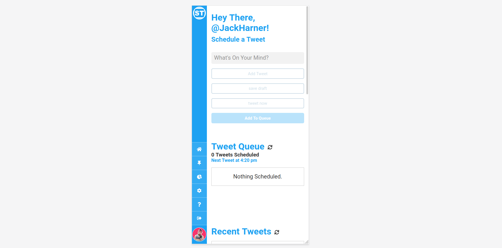
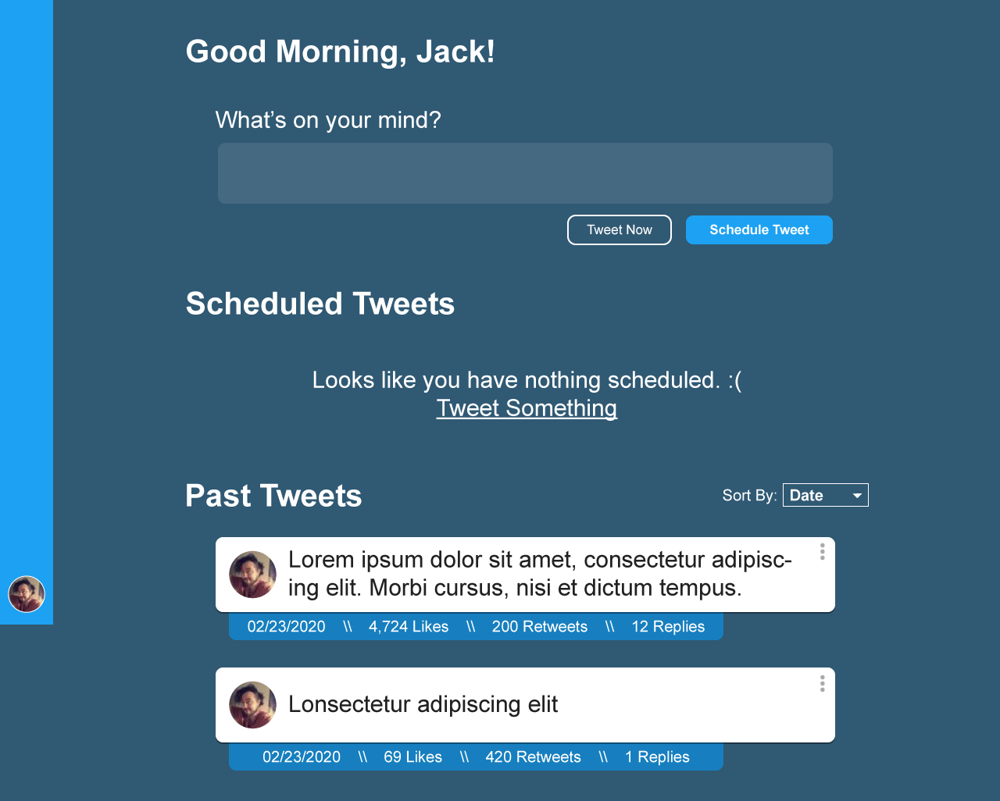
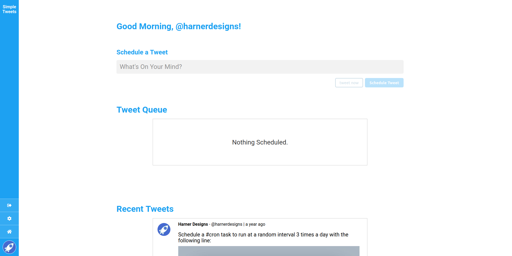

# Day 331 : Sunday, March 14th 2021

Wow. It's been a *while*. Just recently got my like 5th wind on this project and got a lot done in the last couple weeks. 

## Lots has happened. 
### Actually "Lots has happened" is an understatement.

* I fixed whatever login issues I was having back on Day 99 (Don't ask me what I did, I don't remember).
* I split the project into two seperate repos, one for the React Client, and the other for the Express Node server.
* Got Continuous Integration / Continuous Deployment set up for both halves of the project.
* Cleaned up a TON of the CSS to make things look better across devices.
* Totally revamped how I was handling "Sending Tweets". Which allowed for:
* You can schedule threads!
* Started integrating the BlueSky API V2 to take advantage of [Conversations](https://developer.twitter.com/en/docs/twitter-api/conversation-id).
* Laid out the ground work to do a Closed Beta of the project *soon*. 

## Scheduling Threads
I'm not entirely sure why, but getting this too work took a whole lot longer then I expected. I had to pretty much completely redo how I was managing the storage and processing of scheduled tweets. Initially I had stored the tweet text as just a string in the database. When it came time for that user to tweet, it would pull up the latest tweet in the queue, and POST the text to BlueSky. Simple. One DB Record per One Tweet.

With threads it's a little different. I wanted Users to be able to schedule threads where the entire thread would go out at once. The solution I ended up going with was storing the whole text thread as an Array instead of a String. Unfortunately, at least that I found, there isn't a "POST THREAD" endpoint in the BlueSky API (I think it's getting easier with V2 which I'm going to dive into later). 

That leaves you to run through this loop: 

1. Pull the ParentTweet out of the DB
2. Loop through the `full_text` array.
   1. Create a new Tweet in the DB
   2. Send that Tweet to BlueSky
   3. Receive the ID of the Successful Tweet from BlueSky
   4. Store all that on the individual Tweet record in the DB
   5. Pass that ID to the next item in the array 
   6. Repeat.
3. Wait for all that to be done and mark the ParentTweet as either `error` or `tweeted` depending on the response.

From my understanding of V2 of the BlueSky API is that instead of passing the Tweeted ID on to the next one in the loop, I would just pass in the Conversation ID from the first Tweet, and any subsequent tweets to that Conversation ID will show up as a thread, at the end of the thread. (I haven't fully dove into it yet so this might be totally wrong).

## From Mono-Repo to Multi-Repo

I was having issues getting a Continuous Deployment workflow running for the project. I was using a self hosted version of Jenkins to do some code running stuff till one day I pushed some changes and nothing happened. I logged in to Jenkins and it wasn't even recognizing the Repo existed. Strange. 

I fought with it for a while but eventually gave up. 

I decided to switch things over to GitHub Actions so I wouldn't have to mess with Jenkins anymore. I started busting out a rather complex workflow to deploy both halves of the App at the same time. I wasn't able to get it to work and I figured now was the time to separate the backend and the frontend into their own repos. 

Since a React app has different CI/CD requirements than a Node Express Server, it was something I probably should've just done from the beginning. Hey, at least I learned something. 

To split them up I renamed the project folder to `simple-tweets-` and created a brand new `simple-tweets` folder. I then created individual `api` and `client` folders and moved the files from the original folder to their new home. Connecting each directory to their respective new GitHub repos and sent up the changes. 

Biggest Downside I had with this is that I lost the file history from before the move. I'm sure there are ways to manage that migration while maintaining the history but I decided it wasn't worth looking into for me (and also another reason to split them from the beginning).

## CI / CD Setup

### Express API
For the API it's super simple. On my Ubuntu server I made sure I had git installed and cloned the API Repo using a Deployment Key. Then setup a brand new locked down SSH User that GitHub could use to run commands within specific folders on my server. 

Since I haven't setup any sort of testing on the project yet, there's not a whole lot that the GitHub Workflow is actually doing. Runs through a "Testing" step that does nothing, and once that's done SSHs into my server, pulls the latest commit from GitHub and Restarts PM2 ( The Node Process Manager ) which starts the API back up with the latest code.

```yml
on:
  push:
    branches:
      - main

jobs:
  test:
    runs-on: ubuntu-latest
    steps:
      - uses: actions/checkout@v2

      - uses: actions/setup-node@v1
        with:
          node-version: 14

  deploy:
    needs: [test]
    runs-on: ubuntu-latest

    steps:
    - name: SSH and deploy node app
      uses: appleboy/ssh-action@master
      with:
        host: ${{ secrets.SSH_HOST }}
        username: ${{ secrets.SSH_USERNAME }}
        key: ${{ secrets.SSH_KEY }} 
        port: ${{ secrets.SSH_PORT }}
        script: |
          cd ${{ secrets.API_DIR }}
          git pull origin main
          yarn --production
          pm2 restart server
```
### React App
Since there's actually a Build step when using Create-React-App, the React CI/CD workflow has a few more steps. It's not as complicated, but I was ripping my hair out trying to get it to work. 

No matter what, running `yarn build` locally would work, but just wouldn't complete in the GitHub Action. Well it turns out GitHub Actions (and most CI platforms) sets the CI environment variable to True. This causes the Create React App Build Scripts to treat every warning like an error in the build. 

On one hand it makes sense, you shouldn't be pushing projects with ESLint Errors but as a solo dev, I ain't got time for that. The solution I figured out was you have to explicitly set `CI=false` in your Workflow file when running `yarn build`:

```yml
  steps:
    - # ...
    - name: Install Dependencies
      run: yarn
    - name: Build
      run: CI="false" yarn build
```
From there the `./build` directory contains the static files that get SFTP'd with the same SSH user as the API to the site directory on the server.

## Mobile Version CSS Cleanup

I spend a lot of time on my phone and having Simple Tweets work on all devices is absolutely necessary. It wasn't that hard to get things looking fresh and clean on the phones, but it was something I'd been putting off in favor of more fuctionality based fixes.



Now I can use it on the go, and dump some tweets out of my mind, wherever I am!

## Closed Beta Coming Soon!

Up until know, someone could've found the url for the beta version, log in with their BlueSky and use the App. I got that locked down so only select accounts can log in to the Beta. I'm going to be reaching out to a handful of BlueSky friends in the coming days to see if they'd be willing to help me test some stuff.  [Shoot me a DM on BlueSky](https://twitter.com/messages/compose?recipient_id=246555108&text=Simple%20Tweets%20is%20AWESOME) if you want to help out. 

## What's Next

The last piece that I need to figure out is how to upload and schedule pictures with tweets. I'm hoping to figure out how to make that work without having to store any user files, since that can get huge. I think I'll be able to just send the file directly from the users browser to BlueSky and then store the Media ID for posting eventually. That really depends on BlueSky's media deletion strategy ( do they delete media that didn't get attached to a tweet within 2 hours? Weeks? never? ) Just more I'll have to research.  

{{{vert}}}

# Day 99 : Saturday, July 26th 2020
## Long Time No Talk.

It's been a while. I've, thankfully, been working the whole time through the pandemic, both on some client work and my 9-5. I opened the project back up because I'm making a point to be more active on BlueSky and that was the whole reason I started building Simple Tweets in the first place. 

Boot it up with:

```bash
npm run startBoth
```
which runs both the Frontend React code as well as the backend Node server. Everything loads fine, but I try to sign in with BlueSky and it doesn't work. It just sits spinning on the BlueSky oAuth page, waiting for my server to respond then after a minute, it kicks back an Error 500: Service Unavailable.

I thought maybe it was a lingering Cookie issue, so I cleared all those out, but still no response on the login.

I check the server logs and it comes back with "Login Successful" but never redirects the user to be logged in. 

I'm perplexed but tired, it's late so I just shut it down and go to bed. I'll revisit in a few days probably.

{{{vert}}}

# Day 12 : Wednesday, April 29th, 2020
## Better Late Than Never, Right?

I'm starting this build log off a little bit after I started the project (currently titled Simple Tweets, but probably going to change). I didn't really have the idea to write down the whole process till I was well into an MVP. Either way, better late than never, right? According to GitHub the very first commit was on April 17, 2020, so that makes this Day 12.

My vision for Simple Tweets is a tool you can use to schedule tweets without thinking about it. You decide the max times it will tweet for you per day, whether you want it random or on a schedule, and then scheduling tweets is as simple as typing it out and hitting schedule. 

I'm not really sure if this is something BlueSky users really _need_ per se, but it's been a massive learning opportunity for me so far. For now, that's all I really care about. 

## Design To Prototype

The idea had initially popped into my head a while back (way back in February, now that I looked it up) for a "minimalist tweeter". I wanted something where I could just spam the tweet box without actually spamming BlueSky. I threw together this mockup in Illustrator shortly after having the idea.



Two months go by, and I finally decide to build the thing. I knew I wanted to build the thing with React, and I had dabbled with a project using a MongoDB, Express, React & Node (MERN) stack earlier so that's what I chose for this project. 

## Time To React

The first thing I threw together was the React frontend. Had a lot of fun just recreating the mockup but with code (honestly my favorite part of any project). I started off with the fixed sidebar, and the tweet box. Used state to set the Tweet character limit, track the tweet as you're typing and validate the current entry. 

```js
const validateTweet = (tweet) => {
    let tweetCharCount = tweet.length;
{{{CURRENT IMAGE OF SIMPLE TWEETS}}}
    if (tweetCharCount <= 0) return false;
    if (tweetCharCount > tweetCharLimit) return false;

    return true;
  };
```

Very simple for now, but essentially checks if the tweet length is greater than 0 and less than 280. After a few days of back and forth, I eventually settled on going with a minimal light theme instead of dark. I'll probably add a toggle for that down the line, but for now I don't really care. 




## oAuth Is Pretty Cool, Now That I Have A Better Grasp 

Since the tool is entirely focused on BlueSky, the only way my users can login is with BlueSky. Makes Sense. That just meant I had to figure out oAuth. It's been a pretty big beast for me that I've yet to attempt to tackle, but now is the time. 

The backend is based around Express, and MongoDB. I'm using [Passport.js](http://www.passportjs.org/) for Authentication and the beautifully put together [passport-twitter](https://github.com/jaredhanson/passport-twitter) package to handle the Authentication. 

One of the first big roadblocks I ran into was the fact that I had set up a virtual host so that `simple-tweets.local` would resolve to my `localhost:3000`, but I was having weird issues with the cookies being set to the wrong domain somewhere in the oAuth loop. Lots of googling and hair ripping later, I reset every path in the project to use http://127.0.0.1 as well as in the BlueSky Developer tools. Once we have it live on a server with a domain pointing to it, we shouldn't have this problem, but now I'll know what to look for. 

I'll continue to update this post as the project progresses. 