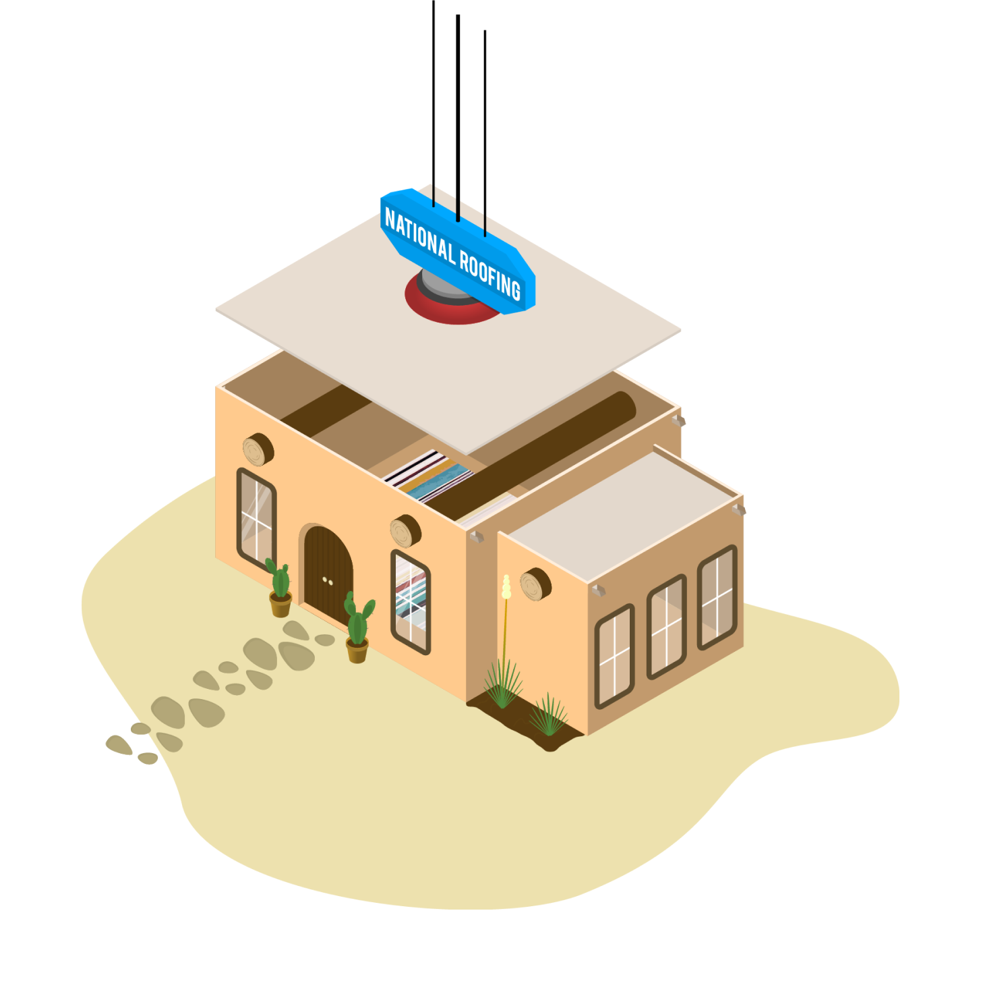

National Roofing is one of the leading Commercial Roofers in New Mexico, servicing most of the South West. 

## The Problem:

National's site was initially built on Wix. All of the content was outdated, it wasn't easy to maintain at all, and they were in dire need of a full site rebuild.

## The Solution:

> ### 
Scrap Everything and Start Over.

## The Process

Over the duration of the project, I worked with several key people in the company to ensure the site was going to meet the needs of everyone who had a say. I started with a rough mockup of the design, in order to quickly get a plan locked into place. 

Once the design was approved, I started working on both the base theme code as well as the illustration that I was going to eventually animate for the homepage.

## The Illustration

National Roofing was in the process of bringing their years of commercial roofing experience to the residential market. I designed an illustration for animation of a crane slamming a roof onto a house.

The house is in the style of a traditional New Mexico adobe house, and when the roof lands on the house, the illustration switches from black and white to color. Check it out on [NationalRoofing.com](https://nationalroofing.com)

## Built On WordPress

They wanted an easy way to add and update content as the site grew. I built out custom post types for their different Services, Projects, Testimonies & more. Their main complaint about their old site was all the work required to update the content. With WordPress, updating anything on the site is as easy as posting to Facebook. 

## Continuous Integration

I knew that they were going to have me continue updating the site, so I set up their repo with a GitHub Action that updates the theme on their site [automatically](/blog/tags/automation/).