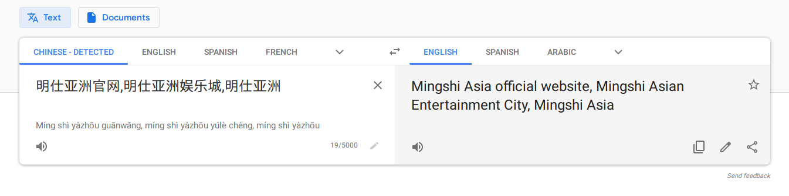

JackHarner.com hasn't always been this beautiful piece of web design history you see today. It most certainly has not. It was the first domain I ever bought and it's gone through a myriad of changes over the years. 

Thanks to the WayBack Machine, here's the earliest iteration of this site I ever created from back in 2013:


By the end of 2014 I had started down the path towards "good design". It's definitely early stages and obviously not great, but it's nice to see progression in my work.


## Where The Fun Begins

In 2016, some big changes were going on in my life and I unfortunately didn't have the money to renew JackHarner.com. I don't know if I just forgot, or what but it expired and was immediately scooped up by some chinese spam company. They plastered it with ads for free hentai and boner pills in hopes that my domain would send them all kinds of traffic once they rerouted it (ha!). 



(For obvious reasons, the WayBack Machine didn't save copies of this chunk of the history.)

## Dropped Like a Dead Domain

In 2017 when it came time to renew, the original company that bought it decided not to renew. I assume that was due to the surprisingly low amount of traffic my domain had been getting at the time. 

I had assumed that all hope was lost so I didn't even think to check. It expired and was picked up by some other company or individual. Again hoping to bank off of traffic to the now twice removed domain. 

This time, luckily, they just left the GoDaddy "GIVE ME LOTS OF MONEY FOR THIS DOMAIN" landing page up.

## We Don't Negotiate with Squatters

Once again, I lost hope of ever getting my name domain back. The buyer can sell the domain for whatever they want, and the moment they find out someone is interested in a domain they own, prices start to skyrocket. I knew I had to just bide my time and wait it out hoping to catch the next open season on JackHarner.com. 

## The Waiting Was Killing Me

This time I paid attention and added the expiration date from the WHOIS at the time. The day finally rolled around and to my great surprise the domain had expired! I was going to get it back! Turns out it was still in the 30 day Grace Period, and once that ends, it goes into a "Redemption period" where it can get auctioned off by the upstream domain vendors.

## August 10th, 2018

After years of waiting, I finally logged on to [NameCheap](https://namecheap.pxf.io/nV95V) one morning to check if it was available, and H O L Y S H I T it WAS! I don't think I've ever purchased anything online so fast in my life.


I threw together a pretty quick 1 page HTML/CSS site to celebrate getting the domain back. Threw it up on GitHub Pages and many beers were had that evening. 

## If You're Reading This In 2019..

There's a good chance you can see the resemblance to that first revision, but there are some pretty massive changes under the hood. 

The site's no longer just a single HTML page. It's generated with Gatsby, the React framework. I'm really enjoying learning and playing with Gatsby and React and I  look forward to seeing what else I can build with it. 

One of my favorite things to build was the Color Picker and integrating it with the CSS variables used to theme the site. 

It uses a pretty simple but kind of math heavy script to calculate the appropriate text color for the chosen color:

```js
  getTextColor = (c) => {

    let o = Math.round(((parseInt(c.r) * 299) + (parseInt(c.g) * 587) + (parseInt(c.b) * 114)) / 1000);
    return ((o > 125) ? ('black') : ('white'));
  }
  ```

## Around The World In 2 Years.

Well there you have it. The brief history of JackHarner.com. If you're using a domain for anything serious, make sure to turn on your Auto-Renew and save yourself 2 years worth of trouble! 