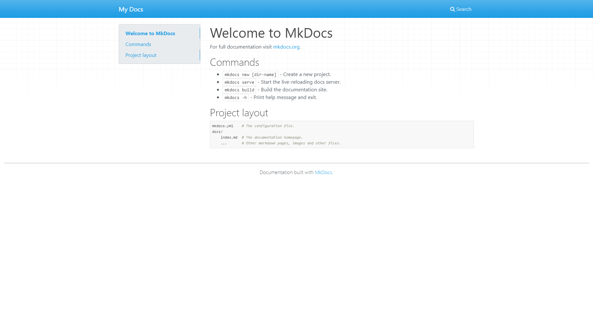

[MkDocs](https://www.mkdocs.org/) is a "fast, simple and downright gorgeous" static site generator for turning a collection of Markdown files into a documentation site. Today, I'm going to walk you through how to get MkDocs setup (which isn't hard).

## What's The Need?

I stumbled across MkDocs because we had some major staffing changes at work, and I wanted a way to keep track of various processes and SOPs for running the day to day. I initially started just with a folder of markdown files on my computer that I would add to as I came across things that needed documenting. 

This worked for a little while but then I needed to be able to share things in the docs with other people at work. I didn't want to have to a lot of time building something. I'm pretty sure I just googled "simple Markdown to HTML" and MkDocs was the first thing that popped up. It was everything I wanted: Simple. Clean. Automatic. Input Markdown Directory. Output HTML Directory. Perfect. 

## Setting It Up.

Enough rambling on the **why**, let's talk about the **how**.

Installation is super easy. They have tons of packages in most of the package managers (apt-get, dnf, homebrew, yum, chocolatey). If you don't use one of those package managers the manual install is also pretty easy. 

MkDocs is built with Python and it supports Python versions 3.5, 3.6, 3.7, 3.8, and pypy3. So make sure you have one of those versions installed along with the appropriate version of pip (python's package manager), and then run: 

```bash 
pip install mkdocs
```
Verify it installed correctly with: 

```bash{outputLines: 2}{numberLines: true}
mkdocs --version
mkdocs, version 0.15.3
```

## Directory Setup

If you're starting fresh, you can just run:

```bash
mkdocs new <procject-name>
cd <project-name>
```

If you already have a directory of Markdown files you want to use MkDocs on, you have 2 options. You can either: 
* Run the `mkdocs new <project-name>` command above and just copy your markdown into the `<project-name>/docs` folder it created
* Create your own `docs` folder in your existing directory and move everything into it that way. Then at the root of your project folder create a `mkdocs.yml` file, and configure it yourself. 

## Fire This Bad Boy Up

MkDocs installs with a dev server you can use while updating everything. Make sure your shell is in the `<project-name>` folder and run: 

```bash{outputLines: 2-6}
mkdocs serve
INFO    -  Building documentation...
INFO    -  Cleaning site directory
[I 160402 15:50:43 server:271] Serving on http://127.0.0.1:8000
[I 160402 15:50:43 handlers:58] Start watching changes
[I 160402 15:50:43 handlers:60] Start detecting changes
```

MkDocs is now watching your directory for changes and building those changes to `http://127.0.0.1:8000`. Visit that url in your browser and you're greeted with this: 



## Configure Your Site

Everything you can configure for your Docs Site goes into the `mkdocs.yml` file in the root of the project. 

There are about a billion different configuration options for MkDocs, so rather than go through them all I'm going to just link you to the [docs site for MkDocs (conveniently built with MkDocs)](https://www.mkdocs.org/user-guide/configuration/).


## Fill it

Inside your projects `docs` folder is where all your Markdown files go. `mkdocs new` creates an `index.md` file that's converted into the landing page. Include instructions about the docs site here. Telling users what kind of information they'll find here. 

Depending on the complexity of your documentation you can add more Markdown files into the `docs` folder, or if you need you can create sub-folders, for example `docs/test/`. 


## Custom Navigation


As you flush out your `docs` folder, you'll notice the navigation bar at the header is automatically generated: 


MkDocs automatically turns Folders into dropdowns, and top level files into links. If you want specific selections in your nav you can configure that in your `mkdocs.yml` file by adding the nav option:

```yml
site_name: MkDocs Test Site
nav:
    - Home: '../'
    - 'User Guide': 'user-guide.md'
    - 'Test Folder': '/test/'
    - 'External Link': 'https://jackharner.com'
```

You can link to specific files, folders, or even external links. However, configuring the `nav` option will stop MkDocs from automatically generating the nav, so you will have to add any new pages to the menu that you create. 


## Build It

When you're done updating the content and you're ready to deploy, you just run `mkdocs build` in the root of your project. Mkdocs generates the files in the `<project-name>/site` folder. Copy the entire `site` folder somewhere online and you will have a fully featured docs site up and running! Wasn't that easy?! 

Since all it uses is Python, it's probably super simple to combine MkDocs with GitHub Actions & GitHub Pages to automatically publish any new changes to the docs site as they get pushed to the repo. (That's a post for another day.)

---

### Let me know what you think about MkDocs
Send me the Docs sites you setup over on Twitter: [@JackHarner](https://twitter.com/jackharner). I'd love to see them!