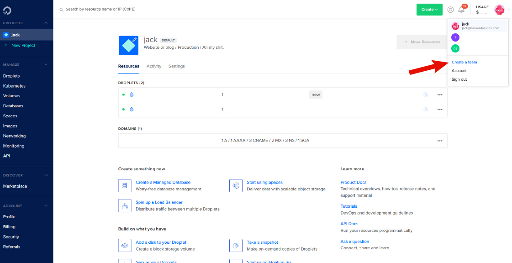
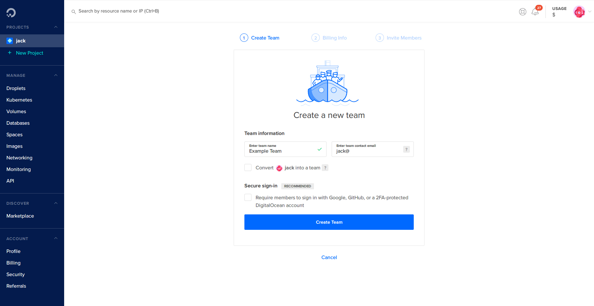
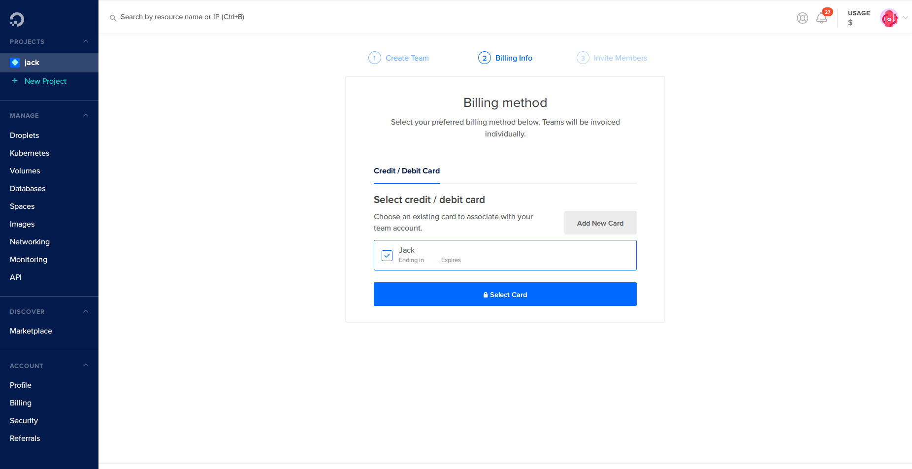
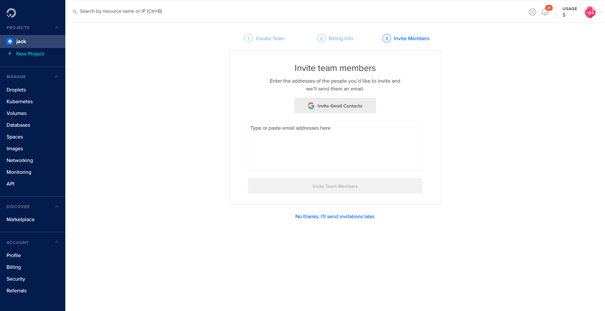

[Digital Ocean](https://m.do.co/c/66cca12b82bc) is a cloud infrastructure company based in New York City. They have blazing fast data centers all over the world and are my personal favorite hosting provider. I point all of my clients there and anytime I need a server or any kind of hosting, Digital Ocean is where I go. Spin up servers in a couple of clicks and you're on your way! 

## Creating A Team

Digital Ocean comes with the ability to create Teams. Teams allow you to share Droplets, Domains, Images, Volumes and pretty much everything else with multiple people, all while keeping the payment info stored securely in the owner's account. 

### Prerequisites

* A Digital Ocean Account ([Sign Up Here](https://m.do.co/c/66cca12b82bc)).
* A credit card attached to your Digital Ocean account. 
* People you want to share access to your Droplets with.

### Let's Just Jump Into It.
The first step is to log in to your Digital Ocean account. 

In the upper right hand corner of the page, click on your little profile picture (or whatever default icon you got). 

Click on "Create A Team".

### It's All In The Name 

Type in your team name and either change or verify the "Team Contact Email". That email is where all the team related billing and alert emails will go. 

> **ONLY** Select "Convert ____ Into A Team" If you already have another Digital Ocean account to invite to the team or you may lose access to the account.

If you'd like to require all users on the team to use 2FA or some other form of secure login, check the box under "Secure Login".

Click on "Create Team"

### Dolla Dolla Bills Y'all

On the next page select (or add) your preferred Payment Method for the Team. This payment method will be used for all charges accrued on the team, but members of the team _will NOT_ have access to your payment info. 

### Invite Time

The next page is where you can invite everyone you want to give access. Enter in 1 Email per line. Those emails will get an invite to either create a Digital Ocean account, or connect an existing one to the team. 

> **REMEMBER** - Anybody you invite to your team can spin up and destroy servers or anything in the account. Be careful who you give access. 

## That's All Folks

Now that you have your DigitalOcean Team set up you can add Droplets to your team, invite more team members, and everything else DigitalOcean has to offer. 