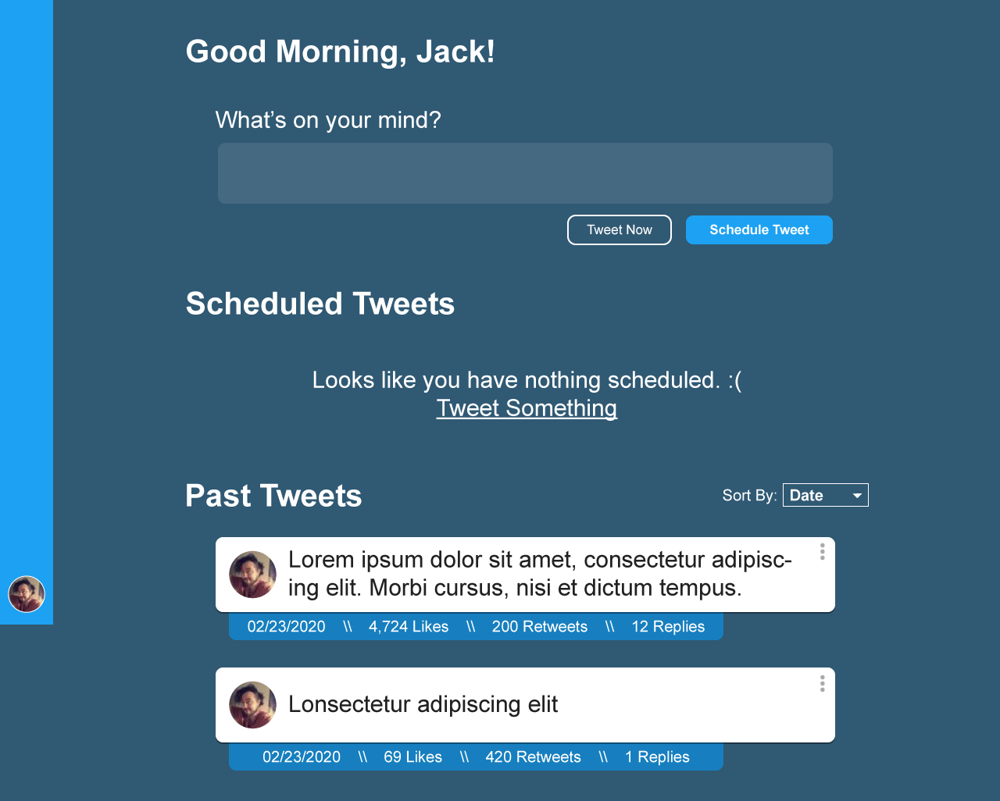

# Better Late Than Never, Right?

I'm starting this build log off a little bit after I started the project (currently titled Simple Tweets, but probably going to change). I didn't really have the idea to write down the whole process till I was well into an MVP. Either way, better late than never, right? According to GitHub the very first commit was on April 17, 2020, so that makes this Day 12.

My vision for Simple Tweets is a tool you can use to schedule tweets without thinking about it. You decide the maximum times it will tweet for you per day, whether you want it random or on a schedule, and then scheduling tweets is as simple as typing it out and hit schedule. 

I'm not really sure if this is something Twitter users really _need_ per se, but it's been a massive learning opportunity for me so far. For now, that's all I really care about. 

## Design To Prototype

The idea had initially popped into my head a while back (way back in February, now that I looked it up) for a "minimalist tweeter". I wanted something where I could just spam the tweet box without actually spamming Twitter. I threw together this mockup in Illustrator shortly after having the idea.



Two months go by, and I finally decide to build the thing. I knew I wanted to build the thing with React, and I had dabbled with a project using a MongoDB, Express, React & Node (MERN) stack earlier so that's what I chose for this project. 

## Time To React

The first thing I threw together was the React frontend. Had a lot of fun just recreating the mockup but with code (honestly my favorite part of any project). I started off with the fixed sidebar, and the tweet box. Used state to set the Tweet character limit, track the tweet as you're typing and validate the current entry. 

```js
const validateTweet = (tweet) => {
    let tweetCharCount = tweet.length;

    if (tweetCharCount <= 0) return false;
    if (tweetCharCount > tweetCharLimit) return false;

    return true;
  };
```

Very simple for now, but essentially checks if the tweet length is greater than 0 and less than 280. 


## oAuth Is Pretty Cool, Now That I Have A Better Grasp 

Since the tool is entirely focused on Twitter, the only way my users can login is with Twitter. Makes Sense. That just meant I had to figure out oAuth. It's been a pretty big beast for me that I've yet to attempt to tackle, but now is the time. 

The backend is based around Express, and MongoDB. I'm using [Passport.js](http://www.passportjs.org/) for Authentication and the beautifully put together [passport-twitter](https://github.com/jaredhanson/passport-twitter) package to handle the Authentication. 

One of the first big roadblocks I ran into was the fact that I had set up a virtual host so that `simple-tweets.local` would resolve to my `localhost:3000`, but I was having weird issues with the cookies being set to the wrong domain somewhere in the oAuth loop. Lots of googling and hair ripping later, I reset every path in the project to use http://127.0.0.1 as well as in the Twitter Developer tools. Once we have it live on a server with a domain pointing to it, we shouldn't have this problem, but now I'll know what to look for. 