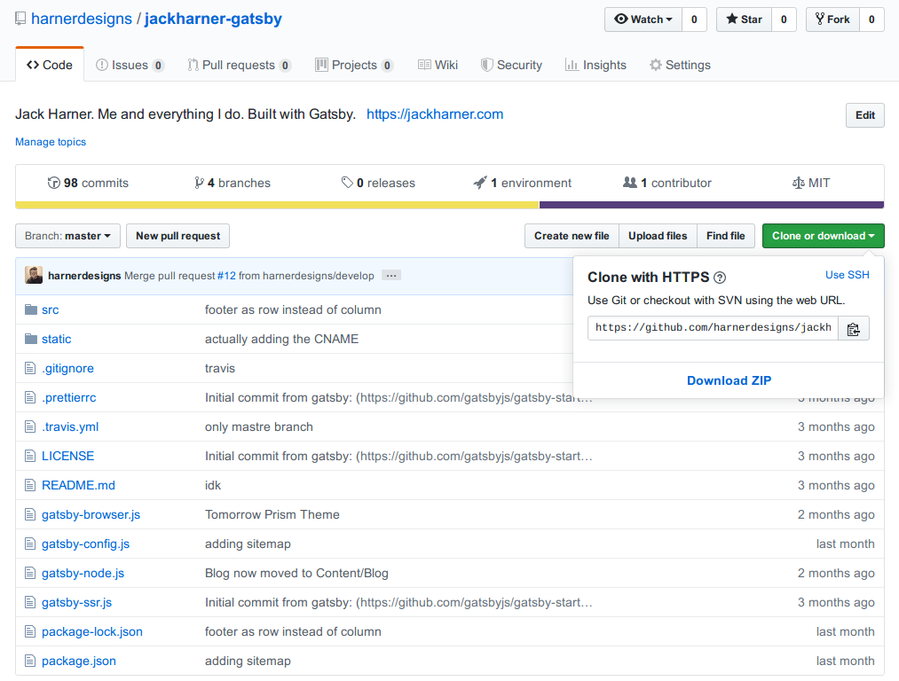

So, you want to make some changes to an Open Source Repo? Good for you. That's the beauty of Open Source, even just fixing typos in the documentation makes a difference. Today I'm going to walk you through keeping your copy of a repo up to date with changes pushed to the original repo. 

This tutorial assumes: 

* You have a basic understanding of git
* You have a forked repo
* The original repo has changes that you want in your forked repo

## Setting Up The Remote

The first thing you want to do is add the Original Repo as a remote of your Forked Repo. From the command line you want to move into your project directory and add the Original Repo's clone URL as the `upstream` remote.

```bash
cd {{project_name}}
git remote add upstream {{original_repo_url}}
```

The Repo URL can be found on the Repo page on Github. Click on the `Clone or download` button and make sure it says "Clone with HTTPS" since you don't have write access to the Original Repo.



You can verify your remotes with:

```bash
git remote -v
```
which should output:
```
origin	git@github.com:{{you}}/{{project_name}}.git (fetch)
origin	git@github.com:{{you}}/{{project_name}}.git (push)
upstream	https://github.com/{{owner}}/{{project_name}}.git (fetch)
upstream	https://github.com/{{owner}}/{{project_name}}.git (push)
```


## Go Get That Code!

Now that we've associated our Original Repo with our local Forked Repo, it's time to go get the new code. 

```bash
git fetch upstream
```
Running `git fetch` gets the changes to the remote repo without changing any of the files in your local version. It essentially lets you see what everyone else has done to the code without making any changes to yours. You should see it pull down a bunch of different branches, tags, and some file changes. 

To apply the new changes to your repo make sure you're on the branch you want to pull in (in our case `master`): 

```bash
git checkout master
```
and then pull the matching branch from the `upstream` remote:

```bash
git pull upstream master
```
It will asks you for a message for the merge commit. You can usually just leave the default and just save with `CTRL + X`. Git finishes up the merge commit, and your Local Repo is now up to date with the Original. 

## Seal The Deal

Finish off your changes by pushing them back up to your Forked Repo's `origin` remote that you have write access to. 

```bash
git push origin master
```
Ta da! You just refreshed your forked repo. Make, test, commit and push your changes and you'll be all set to create a pull request back to the Original Repo. You're ready to start changing the world of Open Source Software one pull request at a time! 